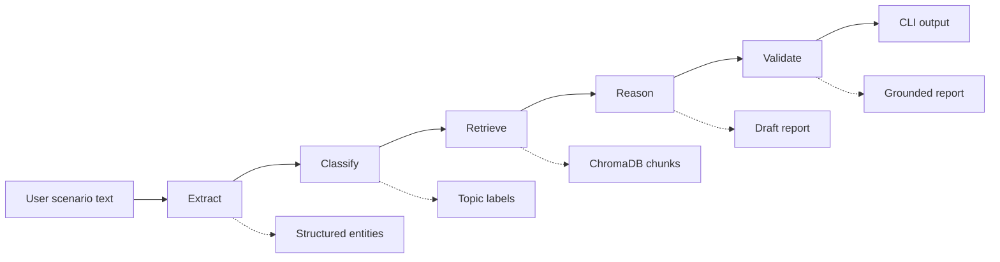
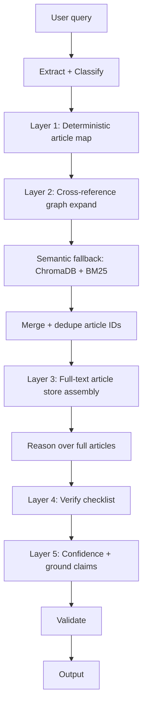
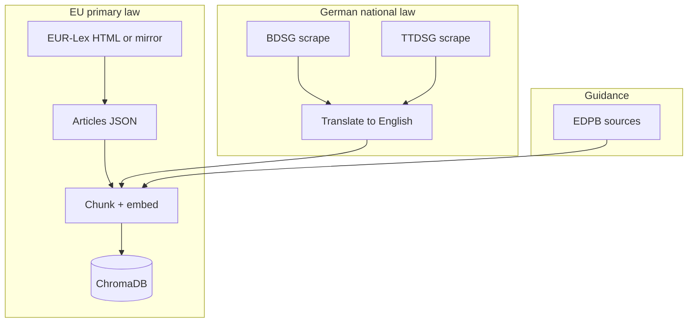

# Architecture

## Runtime pipeline (v1–v3 shipped shape)

1. **Extract** — Parses actors, data types, processing context, and jurisdiction from free text (JSON only).
2. **Classify** — Maps the scenario to an internal topic taxonomy so retrieval can prefer legally relevant chunks.
3. **Retrieve** — Hybrid dense + sparse search over the local vector index with topic-aware scoring.
4. **Reason** — Produces violation hypotheses strictly tied to retrieved chunk text and metadata.
5. **Validate** — Re-checks grounding; citations must reference known chunk ids and source URLs.

## Planned retrieval architecture (v4 — primary path)

**v4** promotes **deterministic** retrieval (article map → cross-reference expansion → **full-text** article assembly) ahead of similarity search. **ChromaDB + BM25** remains the **fallback** for unmapped or long-tail queries. See [v4-overview.md](v4-overview.md) and [ADR-008](adr/008-deterministic-retrieval-primary.md).

### Why deterministic first, similarity second

Legal relevance is **not** the same as embedding nearness. A finite GDPR corpus allows **explicit** topic-to-article rules and **parsed** cross-references; that path is **explainable** and stable. Similarity search still matters for **edge cases**, auxiliary sources (e.g. cases, trackers), and phrases that do not hit the map.

### Cost model (incremental LLM usage)

* **Layers 1–3:** No extra LLM calls for mapping, graph traversal, or store lookup.
* **Reason:** Existing primary reasoning call; context shifts from **chunks** to **assembled full articles** where available.
* **Layer 4 (verify):** One **additional** LLM call per analysis (completeness / checklist).
* **Layer 5:** Structured scoring on the output — implementation may be rules + schema, with **no** extra call if combined with verify.

### Accuracy model

* Deterministic layers are **correct by construction** relative to the curated map and parsed graph (errors become **curation** bugs, fixable with tests).
* **Verification** catches omissions the map and graph did not surface.
* **Confidence** forces **explicit uncertainty** instead of false confidence on ungrounded claims.

## Knowledge base build

German statutes are translated once at index time; runtime retrieval and reasoning use English only.

## Planned extensions (v4)

Future work is documented in [v4-overview.md](v4-overview.md). **Priority 1** is **Near-100% Accuracy Architecture** (deterministic mapping, cross-reference graph, full-text assembly, verification, confidence scoring). **Then:** **Retrieval Gap Tracker** (log and rank ungrounded references, assist KB and **map** curation, measure gap rate), **multilingual retrieval** (German-first, bilingual index), **document upload**, and **website scanning**. Deterministic layers **extend** the existing pre-indexed corpus; they do not replace offline scraping and embedding for **fallback** and auxiliary content.
