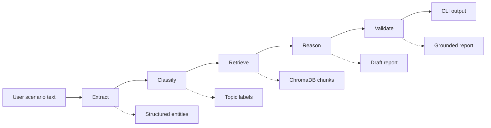
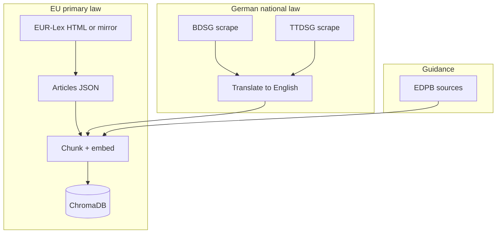

# Architecture

## Runtime pipeline

1. **Extract** — Parses actors, data types, processing context, and jurisdiction from free text (JSON only).
2. **Classify** — Maps the scenario to an internal topic taxonomy so retrieval can prefer legally relevant chunks.
3. **Retrieve** — Hybrid dense + sparse search over the local vector index with topic-aware scoring.
4. **Reason** — Produces violation hypotheses strictly tied to retrieved chunk text and metadata.
5. **Validate** — Re-checks grounding; citations must reference known chunk ids and source URLs.

## Knowledge base build

German statutes are translated once at index time; runtime retrieval and reasoning use English only.

## Planned extensions (v4)

Future work is documented in [v4-overview.md](v4-overview.md). Themes include: **Retrieval Gap Tracker** (log and rank ungrounded references, assist KB ingestion, measure gap rate), **multilingual retrieval** (German-first, bilingual index), **document upload**, and **website scanning**. These extend the same RAG architecture rather than replacing it.
